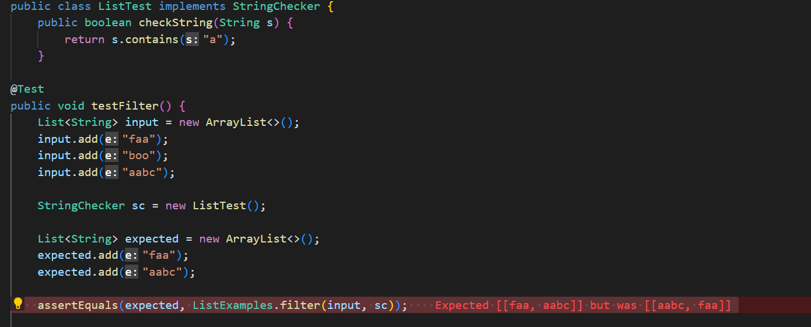

# Lab Report 2 (Week 2 + Week 3)
In this lab, we will learn and practice through all the steps below:

* Make the Simplest Search Engine.
* Find Bugs and How to Debug.

## Simplest Search Engine
After learn about building and running the server, we will try to make a simplest search engine that run on the web server.
First, we make a new file called ***SearchEngine.java*** and use what we've learned to do interesting things with it. 
```java
import java.io.IOException;
import java.net.URI;
import java.util.ArrayList;
import java.util.List;

class Handler implements URLHandler {

    List<String> str = new ArrayList<>();

    public String handleRequest(URI url) {

        System.out.print(url.getPath().toString());

        if (url.getPath().equals("/")) {
            String input = "";
            for (int i = 0; i < str.size(); i++) {
                input += str.get(i) + " ";
            }
            return String.format("The item is added: %s", input);

        } else if (url.getPath().equals("/add")) {
            String[] parameters = url.getQuery().split("=");
            if (parameters[0].equals("s")) {
                str.add(parameters[1]);
                return String.format("Item added: %s", parameters[1]);
            }
        } else if (url.getPath().equals("/search")) {
            String[] parameters = url.getQuery().split("=");

            if (parameters[0].equals("s")) {
                String search = "";
                for (int i = 0; i < str.size(); i++) {
                    if (str.get(i).contains(parameters[1])) {
                        search += str.get(i) + " ";
                    }
                }
                if(search.isEmpty()) {
                    return String.format("Item Not Found!");
                }    
                return String.format("Found item: %s", search);
            }
        }
        return "404 Not Found!";
    }
}

class SearchEngine {
    public static void main(String[] args) throws IOException {
        
        Server.start(8000, new Handler());
    }
}
```
**Two thousand years later...**

This is what we have. Let's see how it work!


# Find Bugs and Debug
*"There are no bugs if you don't write any code"*.

**Bug** is a flaw in a program that causes symptoms. The **symptoms** is the behavior you can see such as terminal output, error messages, web page contents... **Failure-inducing input** is data, values, or other inputs that demonstrate a *bug's symptoms*.

There are some examples of the bugs below that caused the test failed:

1) Failure-inducing input:

Symptoms: the `arrays first differed at element [0]; expected:<3> but was:<0>`
The bug in "reversed" is using the newly created array to assign the values to the original array, which causes the given array is overwritten with all 0.


2) Failure-inducing input:

Symptoms: the `arrays first differed at element [2]; expected:<1> but was:<3>`
The bug is the method doesn't save the old number, so when it was time to change the elements in the second half of the array, the original values are already gone. 


3) Failure-inducing input:


Symtomps: the test failed at `java.lang.AssertionError: expected:[[faa, aabc]] but was:[[aabc, faa]]`.
The bug is instead of returning the filtered elements in the normal order, the buggy code returns the elements in reversed order.

**Debug (Code Fixed):**


