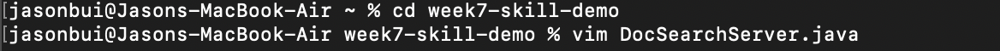

# Lab Report 4 (Week 7)

In this lab, we will practice editing from the command line by using Vim Editor.

## Part 1

**Task:** *Changing the name of the `start` parameter and its uses to `base`*

First of all, we need to clone the repository from `skill-demo1` and put it in the `week7-skill-demo`

`$ git clone https://github.com/ucsd-cse15l-f22/skill-demo1 week7-skill-demo`

From "week7-skill-demo" directory, we start to edit "DocSearchServer.java" in Vim

We use the command line `vim DocSerchServer.java<Enter>` to open file "DocSearchServer.java" in Vim. 

Then, this is how the "DocSearchServer.java" looks like in Vim.

`/start<Enter>`: the command line that we search for the keyword "start" that need to be changed.

`ce`: the command line that switching into input mode and deleting the word "start".

`base` to relace with word "base".

Then, `<Esc>` to exit input mode.

`n`: the command line that going to the next found word.

Using `.` to input from the copy of our last modification.

After changing all the words "start" to "base", we use the command line `:wq<Enter>` to save and exit vim.

There are a lot of ways that we can use to edit this task. One of those is represented above and we can come up with the sequence like this after all:

`vim DocSearchServer.java<Enter>/start<Enter>cebase<Esc>n.n.n.:wq<Enter>`

## Part 2

Following the edit task we chose, there are two ways that we can use for it:

- [***Option 1***] Start in Visual Studio Code and make the edit there, then use `scp` coping the updated file to the remote server and run it on the remote.
- [***Option 2***] Start directly on remote server and make the edit in Vim, then run it on the remote.

After timing the process from the beginning, we ended up with :

| **Option 1** | **Option 2** |
| approx. 6 mins | approx. 5 mins |

For the ***Option 1***, it took longer than because there were so many steps that need to be done between our local and remote machine, which can be affected by the internet speed for uploading files.

For the ***Option 2***, we only worked on the remote server, which cost less time than when you have to back and forth between our local and remote machine.

However, there still exist some problems such as the remote server must have Vim installed, and you know how to use Vim to edit the code directly in Terminal.

### Q&A
1. Which of these two styles would you prefer using if you had to work on a program that you were running remotely, and why?

*If we had to work on a program that we were running remotely, editing code by using Vim directly on the remote server will be our preferred, which is quicly and easier than the other style.

2. What about the project or task might factor into your decision one way or another? (If nothing would affect your decision, say so and why!)

*Depending on the complexity of the task or project, we can choose the appropriate way.*

