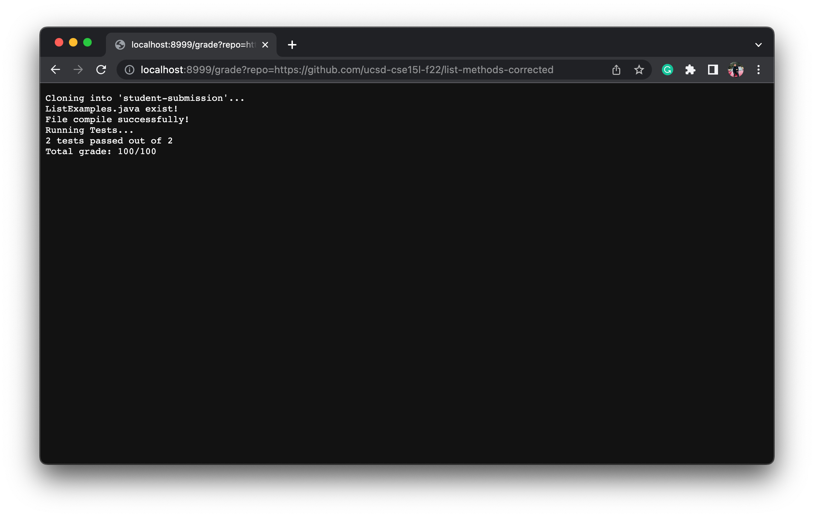
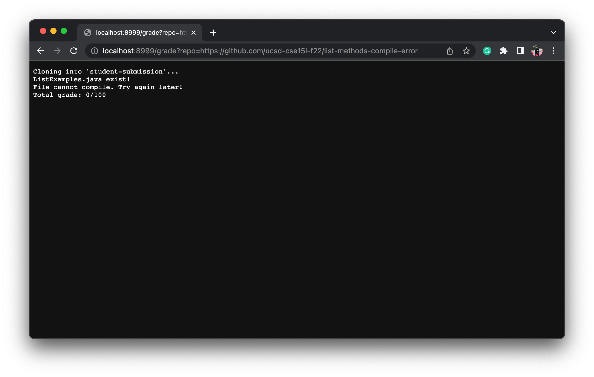

# Lab Report 5 (Week 9)

In this lab, we will write an automatic grader for the student's submissions below:

- https://github.com/ucsd-cse15l-f22/list-methods-lab3
- https://github.com/ucsd-cse15l-f22/list-methods-corrected
- https://github.com/ucsd-cse15l-f22/list-methods-compile-error

## Grading Script

The script `grade.sh` will go through each student's submission and provide their score at the end.
```vim
rm -rf student-submission
git clone $1 student-submission

JU=".:lib/hamcrest-core-1.3.jar:lib/junit-4.13.2.jar"

cp TestListExamples.java student-submission
cp -r lib student-submission

cd student-submission

if [[ -e ListExamples.java ]]
then
    echo "ListExamples.java exist!"
else 
    echo "File was not found. Try again later!"
    echo "Total grade: 0/100"
fi 

javac -cp $JU *.java 2> stderr.txt
if [[ $? -eq 0 ]]
then
    echo "File compile successfully!"
else
    echo "File cannot compile. Try again later!"
    echo "Total grade: 0/100"
    exit 1
fi

echo "Running Tests..."
java -cp $JU org.junit.runner.JUnitCore TestListExamples 2> stderr.txt > stdout.txt

fails=$(head -n 2 stdout.txt | tail -n 1 | grep -o "E" | wc -l)
tests=$(head -n 2 stdout.txt | tail -n 1 | grep -o "\." | wc -l)

echo "$(($tests - $fails))" tests passed out of $tests

if [[ $(($tests - $fails)) -eq 0 ]]
then 
    echo "Total grade: 0/100"
fi

if [[ $(($tests - $fails)) -eq 1 ]]
then 
    echo "Total grade: 50/100"
fi

if [[ $(($tests - $fails)) -eq 2 ]]
then
    echo "Total grade: 100/100"
fi
```
The test file `TestListExamples.java` below that we used to test for the functionality of a student's submission.

```java
import static org.junit.Assert.*;
import java.util.ArrayList;
import java.util.List;
import java.util.*;
import org.junit.*;

class Checker implements StringChecker {
  public boolean checkString(String s) {
    return s.contains("a");
  }
}

public class TestListExamples {
  @Test
  public void testFilter() {
    List<String> input = new ArrayList<>();
    input.add("boo");
    input.add("bar");
    input.add("bean");
    
    StringChecker sc = new Checker();

    List<String> expected = new ArrayList<>();
    expected.add("bar");
    expected.add("bean");
    assertEquals(expected, ListExamples.filter(input, sc));
    
  }

  @Test(timeout = 500)
  public void testMerge() {
    List<String> arr1 = new ArrayList<>();
    arr1.add("a");
    arr1.add("c");

    List<String> arr2 = new ArrayList<>();
    arr2.add("b");
    arr2.add("d");

    List<String> expected = Arrays.asList("a", "b", "c", "d");
    assertEquals(expected, ListExamples.merge(arr1, arr2));
    
  }
}
```
After testing and grading their scores, we will run it through a server by a provided file `GradeServer.java`. We compile it and use command line below to run the server.

`java GradeServer 8999`

This is the result we got so far:

*Student's submission 1*

*Student's submission 2*

*Student's submission 3*



## Tracing the script of *Student's submission 3*

`rm -rf student-submission` : remove *student-submission* (if existed) before doing git clone - exit code 0.

`git clone $1 student-submission` : git clone file from the repository and put it under *student-submission* folder - exit code 0.

`cp TestListExamples.java student-submission` : copy file `TestListExamples.java` from working directory to *student-submission* - exit code 0.

`cp -r lib student-submission` : copy the whole *lib* folder to the *student-submission* folder in order to compile java files - exit code 0.

`cd student-submission` : change working directory to *student-submission* - exit code 0.

`if [[ -e ListExamples.java ]]` : check if student submission file `ListExamples.java` exist or not. 
  - In this case, it's *TRUE* because the file *ListExamples.java* is found, then `echo "ListExamples.java exist!"` to print out an "existing" message - exit code 0. 
  - If it's *FALSE* then `echo "File was not found. Try again later!"` to print out a "not found" message and give score right away "0/100" - exit code 1. (Does not run)

`javac -cp $JU *.java 2> stderr.txt` : compile java files and throw errors to *stderr.txt* - exit code 1. 

`if [[ $? -eq 0 ]]` : check if the java files compiled or not.
  - In this case, it's *FALSE* because there is a syntax error of a missing `;` so the java files cannot compile, it will do `echo "File cannot compile. Try again later!"` to print out "cannot compile" message and give score right away "0/100" - exit code 1.
  - If it's *TRUE* then will do `echo "File compile successfully!"` to print out a "compile successful" message - exit code 0. (Does not run)
 
`echo "Running Tests..."` : does not run because it exited after the `if` statement above.

`java -cp $JU org.junit.runner.JUnitCore TestListExamples 2> stderr.txt > stdout.txt` : run the testing then throw errors to *stderr.txt* and redirect to *stdout.txt*. (Does not run)

Because the script exited after the last `if` statement above, which means the java files could not compile so it would print out *File cannot compile. Try again later!* and give score 0/100 at that step. All the command lines after the `if` statement will not run because the script stopped.

Therefore, the final output for *Student's submission 3* will be: 

```
ListExamples.java exist!
File cannot compile. Try again later!
Total grade: 0/100
```


