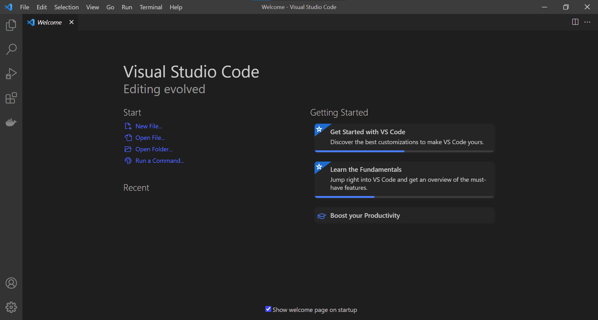

# Week 1 - Lab Report
In this lab, we will learn and practice through all the steps below: 
* Installing VScode
* Remotely connecting
* Trying Some Commands
* Moving Files with scp
* Setting an SSH Key
* Optimizing Remote Running

## Installing Visual Studio Code:

Firstly, we have to download VSCode at the following link below, there are versions for OSX (for Macs) and Windows (for PCs):

WinOS >>> [[*Download*]](https://code.visualstudio.com/sha/download?build=stable&os=win32-x64-user)

MacOS >>> [[*Download*]](https://code.visualstudio.com/sha/download?build=stable&os=darwin-universal)

1) You should find the version that match your major operating system, following the instructions to download and install it on your computer.
2) After the VSCode installed, you can launch a window looks like this: 

## Remotely Connecting:

1. Look up your course specific account at: [UCSD Account Lookup](https://sdacs.ucsd.edu/~icc/index.php)
2. Follow step by step to change or reset your password: [How to Reset Your Password](https://docs.google.com/document/d/1hs7CyQeh-MdUfM9uv99i8tqfneos6Y8bDU0uhn1wqho/edit)
3. Install [OpenSSH](https://learn.microsoft.com/en-us/windows-server/administration/openssh/openssh_install_firstuse?tabs=gui) if you're using Windows - program that connect your computer to other computer link to your account.
4. Open the *terminal* in VSCode, use the command below but replace `zz` with the letter in your own course specific account:

    ` ssh cs15lfa22zz@ieng6.ucsd.edu  `

5. After input your password, you can be able to see the windows looks like this: 

## Trying Some Commands:

Let try some useful commands:

`cd <diectory>` - change directory.

`cd ~` - change your directory to home.

`ls -a` - list all files including hidden files.

