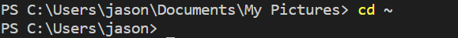
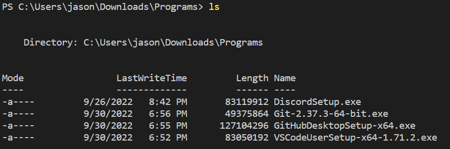

# Week 1 - Lab Report
In this lab, we will learn and practice through all the steps below: 
* Installing VScode
* Remotely connecting
* Trying Some Commands
* Moving Files with scp
* Setting a SSH Key
* Optimizing Remote Running

## Installing Visual Studio Code:

Firstly, we have to download VSCode at the following link below, there are versions for OSX (for Macs) and Windows (for PCs):

WinOS >>> [[*Download*]](https://code.visualstudio.com/sha/download?build=stable&os=win32-x64-user)

MacOS >>> [[*Download*]](https://code.visualstudio.com/sha/download?build=stable&os=darwin-universal)

1) You should find the version that match your major operating system, following the instructions to download and install it on your computer.
2) After the VSCode installed, you can launch a window looks like this: 

## Remotely Connecting:

1. Look up your course specific account at: [UCSD Account Lookup](https://sdacs.ucsd.edu/~icc/index.php)
2. Follow step by step to change or reset your password: [How to Reset Your Password](https://docs.google.com/document/d/1hs7CyQeh-MdUfM9uv99i8tqfneos6Y8bDU0uhn1wqho/edit)
3. Install [OpenSSH](https://learn.microsoft.com/en-us/windows-server/administration/openssh/openssh_install_firstuse?tabs=gui) if you're using Windows - program that connect your computer to other computer link to your account.
4. Open the *terminal* in VSCode, use the command below but replace `ja` with the letters in your own course specific account:

    `ssh cs15lfa22ja@ieng6.ucsd.edu`

5. After input your password, you can be able to see the windows looks like this: 

## Trying Some Commands:

Let try some useful commands on both your computer and the remote computer:

`cd <path>` - change directory.

`cd ~` - change to home directory.

`ls` - list all files in the current directory.

`echo <text>` - display lines of text or string which are passed as argument on the command line.

`cat <file1> <file2>` - show the content of a file or multiple files.

`pwd` - print working directory.

## Moving Files with `scp`
After getting used to the commands, now we'll try to copy a file from your computer to the remote computer with `scp` command. Make sure you're working on your computer, not on the remote computer (if you logged into the remote computer, Ctrl+D to log out).
1. Create the file *JasonComputer.docx* on your computer, in the terminal from the directory where you made this file, run this command below (don't forget to use your username on the remote computer and replace `ja` with the letters in your own course specific account):

    `scp JasonComputer.docx cs15lfa22ja@ieng6.ucsd.edu:~/`

    

2. It will need you input your password in order to access to the remote computer. Again, using `ssh` to log into the ***ieng6*** computer, then use `ls` command to see the file that you copied from your computer.
    
    

## Setting a SSH Key:

Every time we log into the ***ieng6*** computer, it requires input the password. A program that called `ssh-keygen` will help us create a pair of files such as the *private key* and *public key*. You copy the *public key* to a particular location on the ***ieng6*** computer, and keep the *private key* in a particular location on your computer. Then, when we run `ssh` command, it will use the pair of files in place of your password.

On your computer, carefully run `ssh-keygen` command and carefully follow step-by-step below.

The two keys were created on your system. The *private key* is in the file ***id_rsa*** and the *public key* is in the file ***id_rsa.pub***, which both stored in the *.ssh* on your computer.

Log into the ***ieng6*** computer, use `mkdir` command to create a directory to *.ssh*, then Ctrl+D to log out.

Back to your computer, we need to copy the *public key* to the *.ssh* directory of your own course-specific account on the ***ieng6***.

Now you can be able to use `ssh` or `scp` command from your computer to the ***ieng6*** computer without password required!

## Optimizing Remote Running

We can optimizing the remote running by combining and run multiple commands at the same time, or on the same line,

For example, let's try:

Writing a command in *quotes* to multiple action at the same time.

`ssh cs15lfa22ja@ieng6.ucsd.edu "ls"`

**CONGRATULATION!!** Now you learn and know how to access to a remote computer, then using some commands on both your computer or the remote computer. 